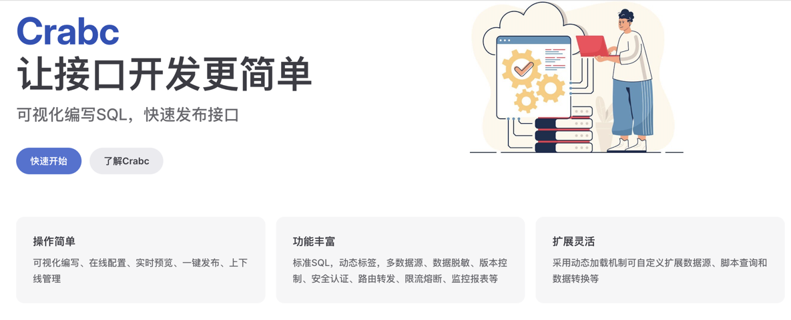
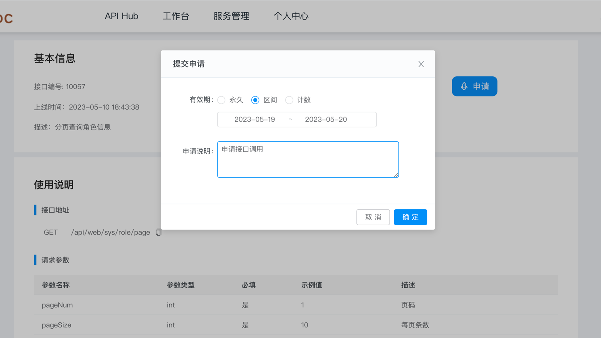
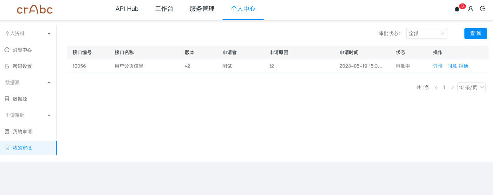

## 介绍
Crabc是低代码开发平台，企业级API发布管理系统，采用SpringBoot、JWT、Mybatis等框架和SPI插件机制实现。
支持接入（mysql、oracle、postgresql、sqlserver、elasticsearch、mongodb）等SQL或/NOSQL数据源，
在编辑框内编写好SQL后即可快速生成Rest接口对外提供服务。支持Mybatis中if等标签语法、数据转换、参数取值、
以及复杂的多SQL执行并支持事务， 减少通用接口的SQL编写，让开发人员专注更复杂的业务逻辑实现。可通过插件的
方式扩展支持其他的数据源， 提供多种权限认证、限流熔断、缓存、监控等提供一站式API服务功能。

## 功能
1.  Hub：可在首页查看公开发布的接口，查询详情和申请访问
2.  接口开发：通过编写SQL的方式即可快速的对外发布成一个Rest接口,支持多SQL同时执行,采用Mybatis标签语法，SQL支持#、$和@等，关联、分页和在线预览。
3.  数据源管理：支持多种SQL/NoSQL数据库接入，数据库新增、编辑、测试链接和删除等。
4.  个人中心：用户管理，密码修改。
5.  应用列表：Code认证和签名认证的应用创建管理以及对API调用在线授权。
6.  接口管理：查看开发中和已发布的API接口，可进行上下线管理，编辑升级等
7.  接口日志：查看发布的接口被调用日志列表和请求详情。
8.  监控统计：可视化查看发布的API被调用统计和监控。
9.  流控规则：限流、缓存、熔断、告警等。
10. 申请审批：可申请Hub中公开的API和审批别人申请调用自己发布的接口

## 模块
~~~
cn.crabc    
├── crabc-gateway            // 网关服务(开发中)
├── crabc-auth               // 授权服务(开发中)
├── crabc-boot               // 业务模块
│     └── crabc-admin        // 后台管理
│           └── static       // 前端静态页面 [9377]
│     └── crabc-datasource   // 数据源加载模块
│     └── crabc-api          // API调用执行模块
│     └── crabc-spi          // 插件定义模块
│     └── crabc-plugin       // 插件中心
├── crabc-common             // 公共模块
├── db                       // SQL脚本
├──pom.xml                   // 依赖
~~~ 
## 运行启动
```
1、先执行db/dml.sql脚本，创建库表和初始化数据
2、在编辑工具中运行启动 crabc-admin/ AdminApplication.java
```
访问地址：http://127.0.0.1:9377
账号密码：admin/admin123

## 说明文档
wiki地址：https://gitee.com/linebyte/crabc/wikis/home

## 演示环境
地址：http://crabc.pingapi.cn

## 商用授权
仅个人学习使用，商用请加群联系

## Docker启动
先执行db/dml.sql脚本，创建库表和初始化数据，建议mysql 8.0+版本
```
> docker pull crabc/crabc-admin:latest
> docker run -p 9377:9377 --env db_url=jdbc连接(如：jdbc:mysql://localhost:3306/crabc) --env db_user=数据库用户 --env db_pwd=数据库密码 -d --name crabc-admin crabc/crabc-admin:latest
```
访问地址：http://127.0.0.1:9377
账号密码：admin/admin123

## 效果截图
#### 首页

### 接口开发


#### 接口属性

#### 请求参数

#### 在线预览

#### 应用创建
 
#### 接口列表 
 
#### 数据库类型 
 
### 限流熔断 
 
 
### 接口申请 
 
### 申请审批 
 

## 交流群
微信群：
 

QQ群：748993036