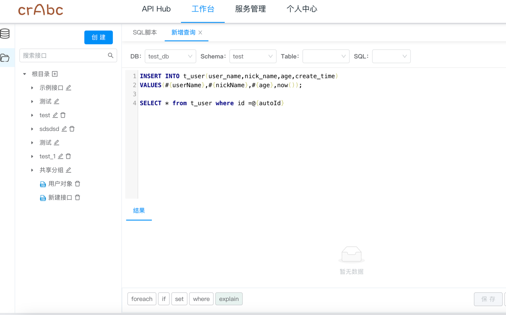
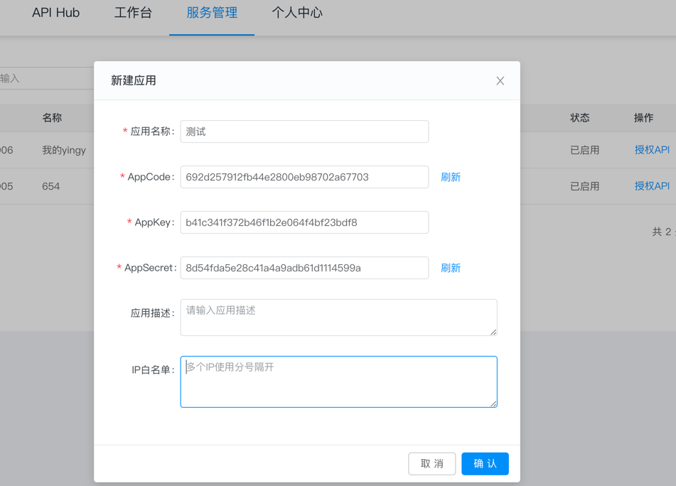
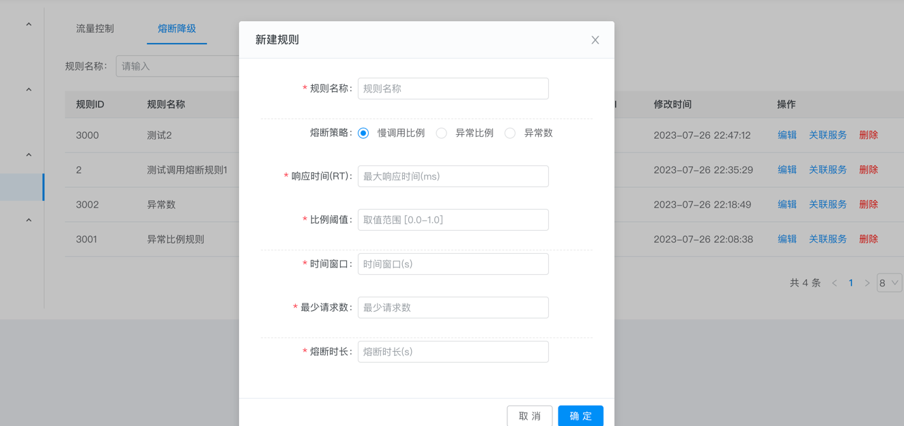

## 介绍
**Crabc** 是低代码开发平台，企业级API发布管理系统，深度整合SpringBoot和Mybatis实现动态数据源和动态SQL。
支持接入（mysql、oracle、postgresql、sqlserver、elasticsearch、mongodb）等SQL或/NoSQL数据源，
在编辑框内编写好SQL后即可快速生成Rest接口对外提供服务。支持Mybatis中if等标签语法、数据转换、参数取值、
以及复杂的多SQL执行并支持事务， 减少通用接口的SQL编写，让开发人员专注更复杂的业务逻辑实现。可通过插件的
方式扩展支持其他的数据源， 提供多种权限认证、限流熔断、缓存、监控等提供一站式API服务功能。

## 功能
- **工作台**：可视化编写SQL快速的对外发布成API接口,支持多SQL同时执行、Mybatis标签语法，实现动态SQL和动态标签
- **数据源管理**：动态加载数据库，支持多种SQL/NoSQL数据库。
- **应用列表**：Code认证、签名认证的应用创建管理以及对API调用在线授权。
- **接口列表**：查看开发中和已发布的API接口，可进行上下线管理，编辑升级等
- **接口日志**：查看发布的接口被调用日志列表和请求详情。
- **监控统计**：可视化查看发布的API被调用统计和监控。
- **流控规则**：限流、缓存、熔断、告警等。

## 模块
~~~
cn.crabc    
├── crabc-boot               // 业务模块
│     └── crabc-admin        // 启动模块
│     └── crabc-core        // 基础模块
│           └── static       // 前端静态页面 [9377]
│     └── crabc-datasource   // 数据源加载模块
│     └── crabc-spi          // 插件定义模块
├── crabc-spring-boot-starter // spring集成包
├── db                       // SQL脚本
├──pom.xml                   // 依赖
~~~ 
## 运行启动
```
1、先执行db/dml.sql脚本，创建库表和初始化数据
2、在编辑工具中运行启动 crabc-admin/ AdminApplication.java
```
访问地址：http://127.0.0.1:9377
账号密码：admin/admin123

## 使用文档
地址：https://www.crabc.cn/guide/

## 演示环境
地址：https://app.crabc.cn

## 商用授权
仅个人学习使用，商用请加群联系

## Maven集成

```
<dependency>
    <groupId>cn.crabc</groupId>
    <artifactId>crabc-spring-boot-starter</artifactId>
    <version>最新版本</version>
</dependency>
```
在程序启动类中添加下面两行注解
```
@MapperScan({"cn.crabc.core.app.mapper","cn.crabc.core.datasource.mapper"})
@SpringBootApplication(exclude = {DataSourceAutoConfiguration.class})
```
## Docker启动
先执行db/dml.sql脚本，创建库表和初始化数据，建议mysql 8.0+版本
```
docker pull crabc/crabc-admin:latest
docker run -p 9377:9377 --env db_url=jdbc连接(如：jdbc:mysql://localhost:3306/crabc) --env db_user=数据库用户 --env db_pwd=数据库密码 -d --name crabc-admin crabc/crabc-admin:latest
```
访问地址：http://127.0.0.1:9377
账号密码：admin/admin123

## 效果截图
### 接口开发


#### 接口属性

#### 请求参数

#### 在线预览

#### 应用创建
 
#### 接口列表 
 
#### 数据库类型 
 
### 限流熔断 
 


## 交流群
微信群：


QQ群：748993036