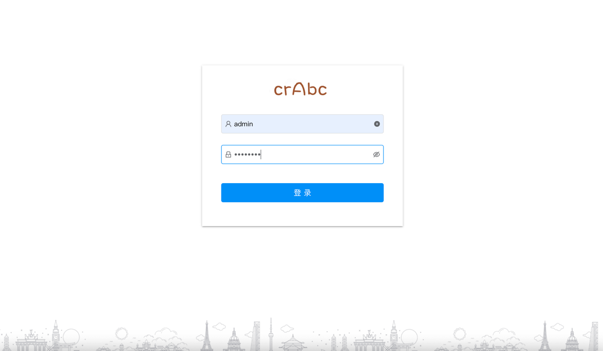
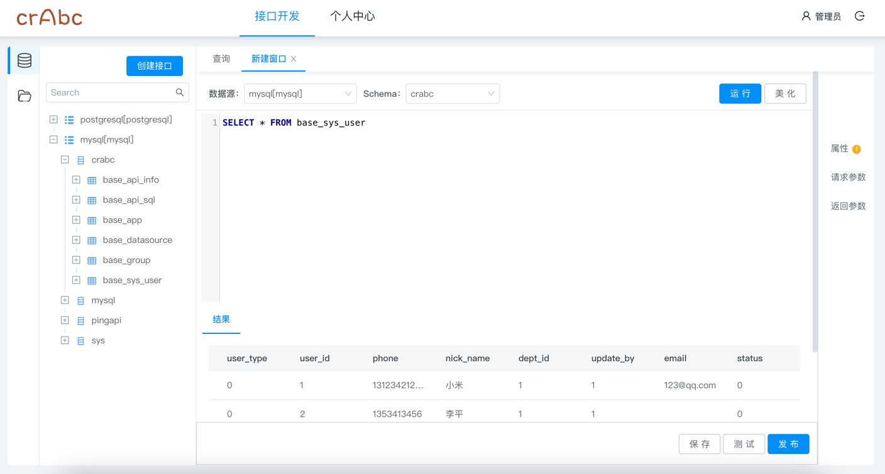
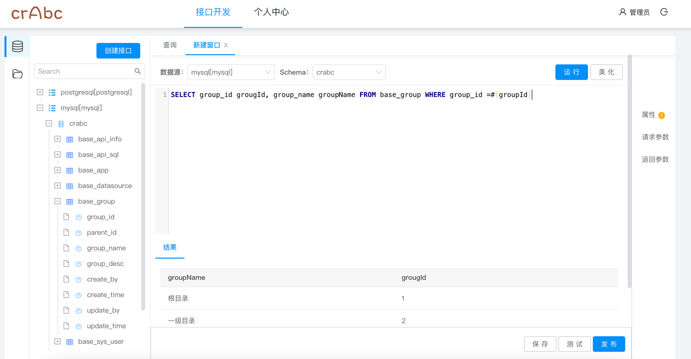
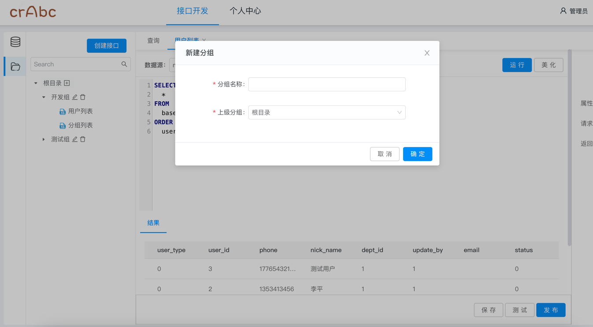
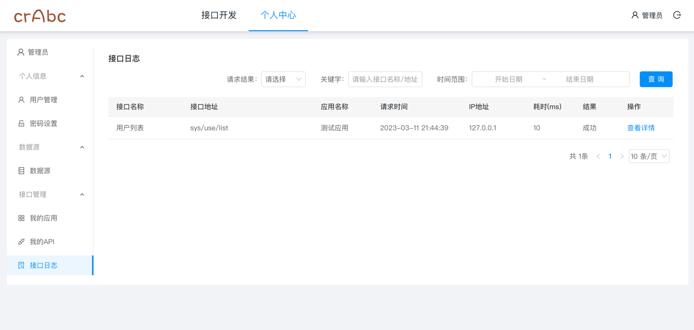
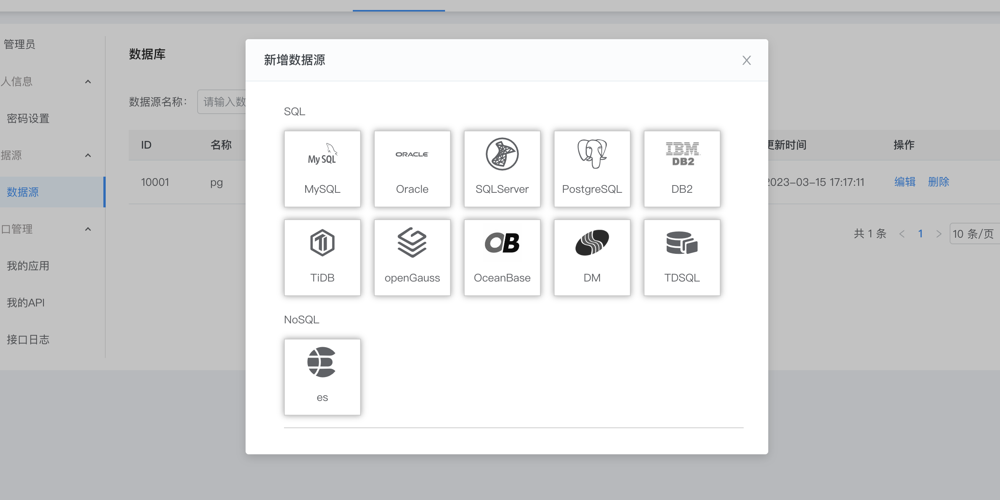

## 介绍
Crabc是低代码开发平台，企业级API发布管理系统，采用SpringBoot、JWT、Mybatis等框架和SPI插件机制实现。
支持接入（mysql、oracle、postgresql、sqlserver、elasticsearch）等SQL或/NOSQL数据源，
在编辑框内编写好SQL后即可快速生成Rest接口对外提供服务，还将提供了一键生成CRUD通用接口方法，
减少通用接口的SQL编写，让开发人员专注更复杂的业务逻辑实现。可通过插件的方式扩展支持其他的数据源。
后续将集成微服务网关支持接口转发、黑白名单、权限认证、限流、缓存、监控等提供一站式API服务功能。

## 功能
1.  接口开发：通过编写SQL的方式即可快速的对外发布成一个Rest接口
2.  数据源管理：数据源列表、数据源新增、编辑、测试和删除等功能。
3.  用户管理：用户管理，密码修改。
4.  我的应用：AppSecret密钥创建管理和API调用授权。
5.  我的API：接口列表、编辑、上线下线管理。
6.  接口日志：查看接口被调用日志详情和状态。
7.  调用监控：可视化查看发布的API被调用统计和监控。（实现中）
8.  策略管理：限流、缓存、熔断、告警、黑白名单等。（实现中）

## 模块
~~~
cn.crabc    
├── crabc-gateway            // 网关服务(开发中)
├── crabc-auth               // 授权服务(开发中)
├── crabc-boot               // 业务模块
│     └── crabc-admin        // 后台管理
│           └── static       // 前端静态页面 [9377]
│     └── crabc-datasource   // 数据源加载模块
│     └── crabc-api          // API调用执行模块
│     └── crabc-spi          // 插件定义模块
│     └── crabc-plugin       // 插件中心
├── crabc-common             // 公共模块
├── web                      // 前端页面（nginx部署）
├── db                       // SQL脚本
├──pom.xml                   // 依赖
~~~ 
## 运行启动
```
1、先执行db/dml.sql脚本，创建库表和初始化数据
2、在编辑工具中运行启动 crabc-admin/ AdminApplication.java
```
访问地址：http://127.0.0.1:9377
账号密码：admin/admin123

## Docker启动
先执行db/dml.sql脚本，创建库表和初始化数据
```
> docker pull crabc/crabc-admin:latest
> docker run -p 9377:9377 --env db_url=jdbc连接(如：jdbc:mysql://localhost:3306) --env db_user=数据库用户 --env db_pwd=数据库密码 -d --name crabc-admin crabc/crabc-admin:latest
```
访问地址：http://127.0.0.1:9377
账号密码：admin/admin123

## 效果截图







## 交流群
微信群：

QQ群：
