# 介绍
**ApiGo** 是接口开发平台，企业项目脚手架，sql2Api，数据预览等。深度整合SpringBoot和Mybatis实现动态数据源和动态SQL、函数和存储过程。
支持接入（mysql、oracle、postgresql、sqlserver、达梦、TiDB、es和hive）等SQL或/NoSQL数据源，
在线可视化编写SQL后即可快速生成接口对外提供服务，接口一键上下线。减少通用接口的SQL编写，让开发人员专注更复杂的业务逻辑实现。
支持Mybatis中if等标签语法、数据脱敏、数据转换、国密加密、协同开发、接口编排等功能，可集成微服务网关支持接入第三方接口、权限认证、限流、缓存、告警监控和统一日志等一站式API数据服务,
助力于企业数据资产价值升级，成为企业数字化转型的重要推动力。

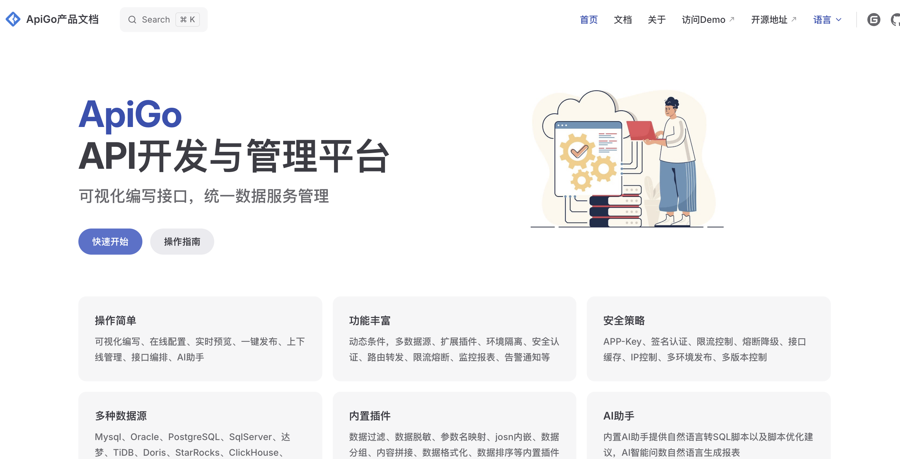
## 社区版功能
- **工作台**：可视化编写SQL快速的对外发布成API接口,支持多SQL同时执行、Mybatis标签语法，实现动态SQL和动态标签
- **数据源**：数据源列表和数据查询，支持多种SQL/NoSQL数据库添加。
- **应用凭证**：AppKey认证、签名认证的应用创建管理以及对API调用在线授权。
- **接口列表**：查看开发中和已发布的API接口，可进行上下线管理，限流控制等
- **接口文档**：生成在线接口文档，支持在线测试。
- **指标统计**：展示场景的接口调用指标统计
- **接口日志**：查看发布的接口被调用日志列表和请求详情。

## 接口开发流程

## 模块
~~~
cn.crabc    
├── crabc-boot               // 业务模块
│     └── crabc-admin        // 启动模块
│     └── crabc-core        // 基础模块
│           └── static       // 前端静态页面 [9377]
│     └── crabc-datasource   // 数据源加载模块
│     └── crabc-spi          // 插件定义模块
├── crabc-spring-boot-starter // 第三方项目maven集成依赖包
├── db                       // SQL脚本
├──pom.xml                   // 依赖
~~~

## 版本说明
dev分支框架SpringBoot已升级至4.0，jdk需21及以上版本 \
jdk8分支框架SpringBoot是2.x + jdk8

## 企业版
https://apigo.cn

## 企业版架构图

## 运行启动
```
1、先执行db/dml.sql脚本，创建库表和初始化数据
2、在编辑工具中运行启动 crabc-api/ AdminApplication.java
```
访问地址：http://127.0.0.1:9377 \
账号密码：admin/admin123

## 官网
官网：https://apigo.cn \
使用指南：http://docs.apigo.cn  \
github：https://github.com/pingapi/apigo

## 商用授权
已申请软件著作，开源版仅供个人学习使用 \
企业版功能更强大，商用请加群联系\

## 源码地址
github: https://github.com/pingapi/apigo \
gitee: https://gitee.com/pingapi/crabc-api 

## Maven集成apigo

```
<dependency>
    <groupId>cn.crabc</groupId>
    <artifactId>crabc-spring-boot-starter</artifactId>
    <version>5.0.1</version>
</dependency>
```
在程序启动类中添加下面注解
```
@SpringBootApplication(exclude = {DataSourceAutoConfiguration.class})
```
集成Demo参考: <a href="https://gitee.com/linebyte/crabc-spring-boot-starter-demo" style="text-decoration: none;" target="_blank">crabc-spring-boot-starter-demo</a>

## Docker启动
先执行db/dml.sql脚本，创建库表和初始化数据，建议mysql 8.0+版本

X86/AMD架构
```
docker run -p 9377:9377 -e DB_URL=jdbc:mysql://localhost:3306/apigo -e DB_USER=root -e DB_PWD=root -d --name apigo crabc/apigo:latest
```
ARM架构
```
docker run -p 9377:9377 -e DB_URL=jdbc:mysql://localhost:3306/apigo -e DB_USER=root -e DB_PWD=root -d --name apigo crabc/crabc-admin:5.0.0
```
访问地址：http://127.0.0.1:9377
账号密码：admin/admin123

## Windows桌面运行
先执行db/dml.sql脚本，创建库表和初始化数据，建议mysql 8.0+版本
```
java -jar crabc-api.jar --spring.datasource.url=jdbc:mysql://127.0.0.1:3306/crabc --spring.datasource.username=root --spring.datasource.password=root 
```

## 效果截图
### 接口开发
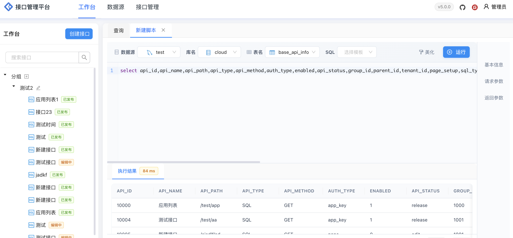
#### 接口属性
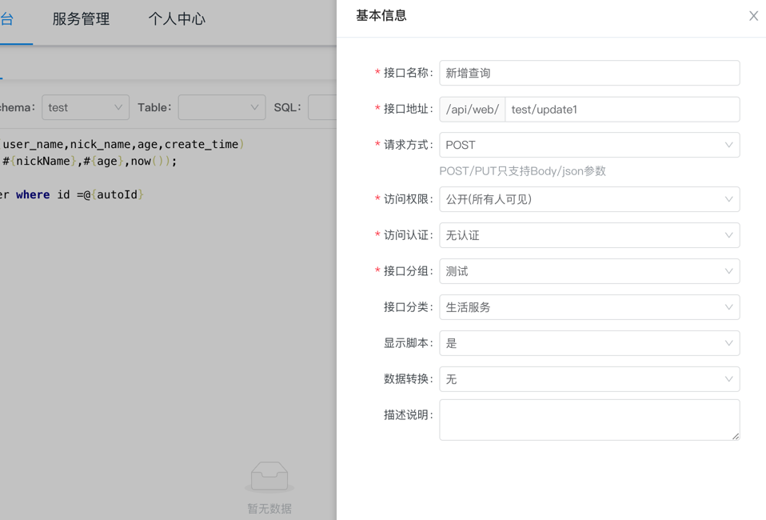
#### 返回参数
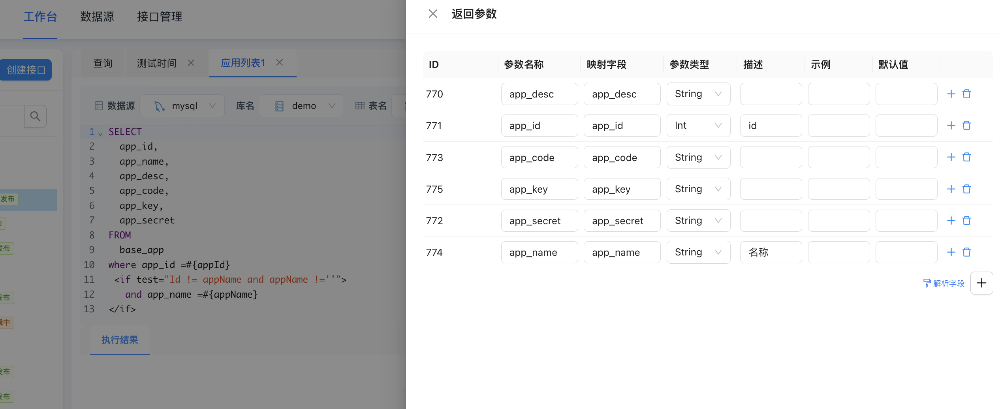
#### 在线预览
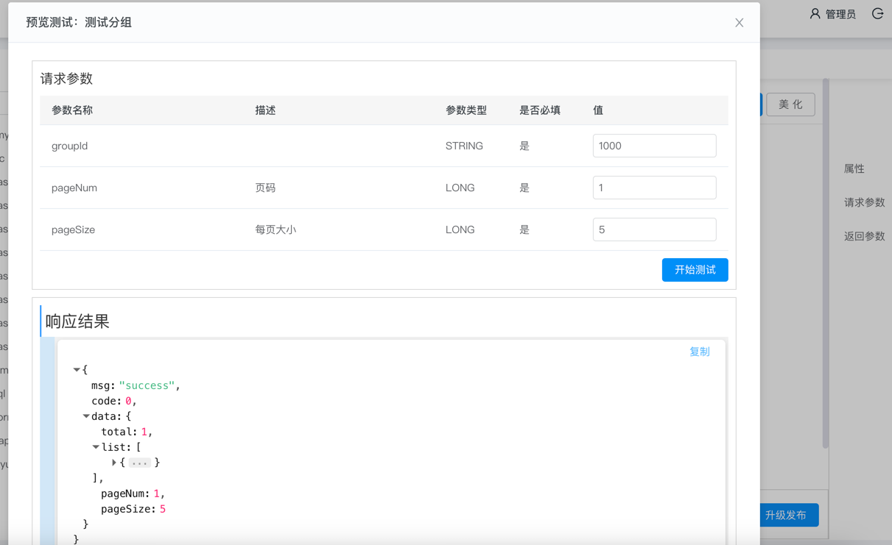
#### 接口列表
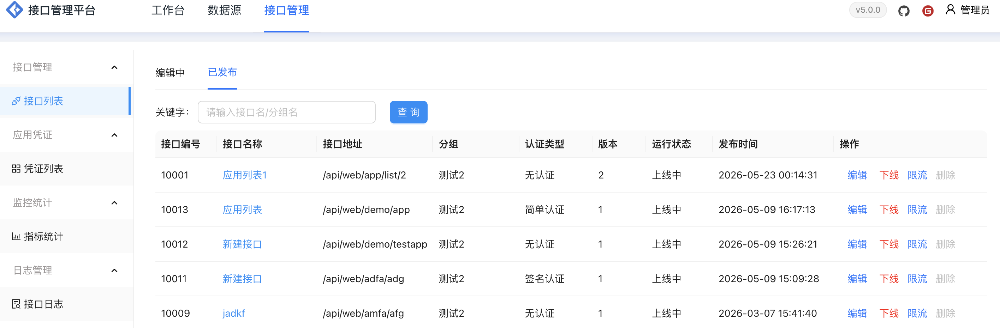
#### 接口限流
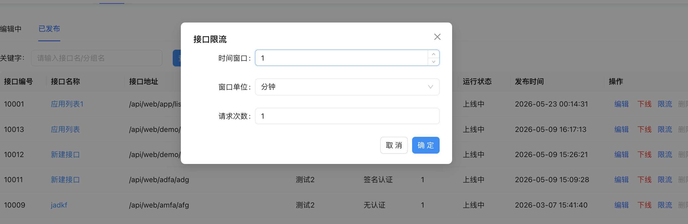
#### 指标统计
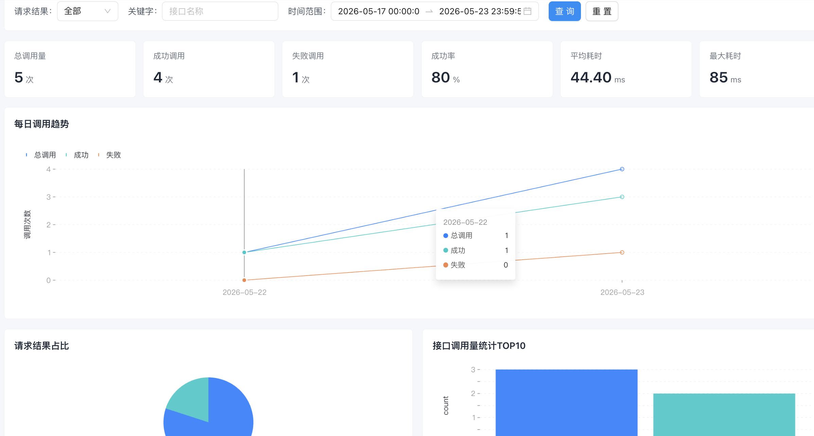
#### 日志管理
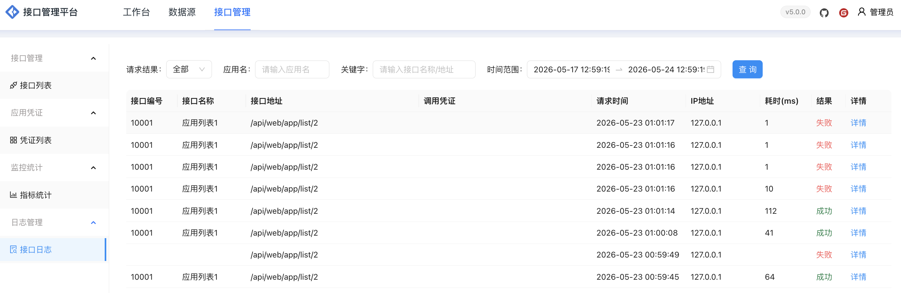
#### 数据源列表
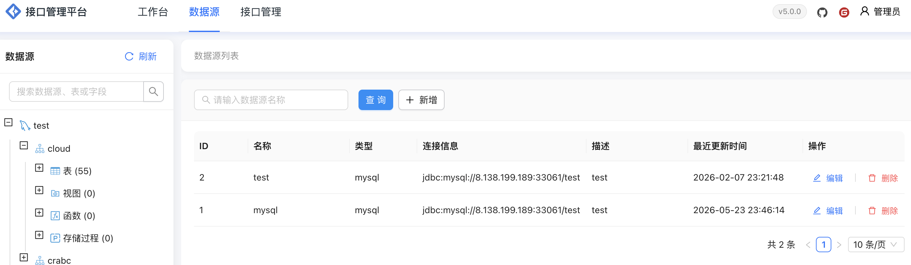
#### 数据查询
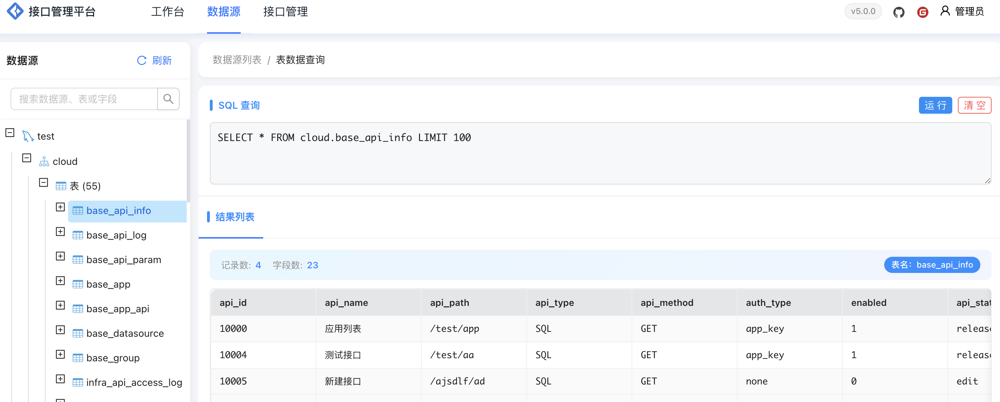
#### 数据源类型
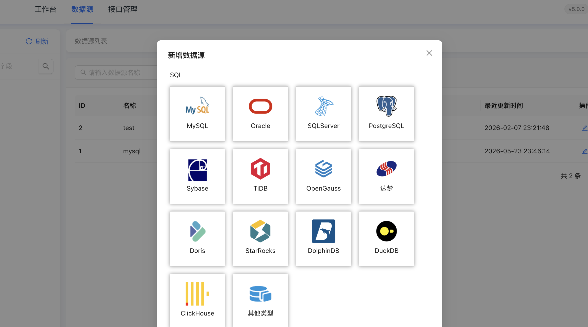

## 交流群
**进群前请先点【Star】谢谢**

QQ群(请先Star)：748993036

商用咨询加微信 (请备注apigo)


## 产品使用登记
以下为部分接入crabc-api的用户 ，<a href="https://gitee.com/linebyte/crabc/issues/IA98CA" target="_blank"> 点击进行登记</a>

| 公司机构         |
|:-------------|
| 西部通信研究院      |
| 青岛巴士科技有限公司   |
| 阳光智维科技股份有限公司 |
| 一步数据科技有限公司   |
| 像素云图科技有限公司   |
| 前景科技有限公司     |
| 方寸图信息有限公司    |
| 鹭栖技术信息公司     |
| 循脉医疗科技有限公司   |
| 云上贵州大数据有限公司  |
| 巨元瀚洋有限公司     |
| 某市供电局        |

## 企业版和开源版对比
| 功能    | 社区版                                                                   | 企业版                                                                                                                               |
|-------|-----------------------------------------------------------------------|-----------------------------------------------------------------------------------------------------------------------------------|
| 架构设计  | 单体                                                                    | 微服务                                                                                                                               |
| 开发模式  | SQL脚本                                                                 | SQL脚本、表格模式、代理模式、接口编排                                                                                                              |
| 接口编排  | 不支持                                                                   | 支持                                                                                                                                |
| 动态标签  | 支持                                                                    | 支持                                                                                                                                |
| 动态路由  | 不支持                                                                   | 支持                                                                                                                                |
| 数据库   | SQL：mysql/oracle/postgresql/sqlserver <br>TiDB/OpenGauss/Doris/duckdb | SQL：mysql/oracle/postgresql/sqlserver/tidb<br>/opengauss/doris/oceanbase/dm/gbase <br> NoSQL：es/mongodb/hbase <br> TSDB: TDengine |
| 认证方式  | 无/Code认证/签名认证                                                         | 无/Code认证/签名认证                                                                                                                     |
| SQL类型 | 查询/插入/更新/删除等多脚本SQL                                                    | 查询/插入/更新/删除等多脚本SQL                                                                                                                |
| 结果类型  | json                                                                  | json/Excel                                                                                                                        |
| 接口日志  | 支持                                                                    | 支持                                                                                                                                |
| 协同开发  | 不支持                                                                   | 支持                                                                                                                                |
| 数据源权限 | 不支持                                                                   | 支持                                                                                                                                |
| 插件市场  | 不支持                                                                   | 支持                                                                                                                                |
| 接口市场  | 不支持                                                                   | 支持                                                                                                                                |
| 申请审批  | 不支持                                                                   | 支持                                                                                                                                |
| 接口授权  | 不支持                                                                   | 支持                                                                                                                                |
| 系统权限  | 不支持                                                                   | 支持                                                                                                                                |
| 用户管理  | 不支持                                                                   | 支持                                                                                                                                |
| 数据脱敏  | 不支持                                                                   | 支持                                                                                                                                |
| 仪表盘指标 | 不支持                                                                   | 支持                                                                                                                                |
| 版本管理  | 不支持                                                                   | 支持                                                                                                                                
| 接口缓存  | 不支持                                                                   | 支持                                                                                                                                |
| 限流熔断  | 支持限流                                                                  | 支持                                                                                                                                |
| IP控制  | 不支持                                                                   | 支持                                                                                                                                |
| 监控报表  | 支持                                                                    | 支持                                                                                                                                |
| 告警通知  | 不支持                                                                   | 支持                                                                                                                                |
| 集群模式  | 不支持                                                                   | 支持                                                                                                                                |
