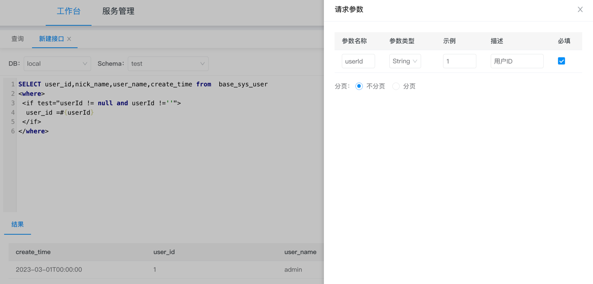

## 介绍
**Crabc** 是低代码接口开发平台，企业级API管理系统，深度整合SpringBoot和Mybatis实现动态数据源和动态SQL。
支持接入（mysql、oracle、postgresql、sqlserver、达梦、TiDB、es和mongodb）等SQL或/NoSQL数据源，
在线可视化编写SQL后即可快速生成接口对外提供服务，减少通用接口的SQL编写，让开发人员专注更复杂的业务逻辑实现。
支持Mybatis中if等标签语法、数据脱敏、数据转换等功能，集成微服务网关支持接口代理转发、权限认证、限流、缓存、告警监控等一站式API服务。

## 功能
- **工作台**：可视化编写SQL快速的对外发布成API接口,支持多SQL同时执行、Mybatis标签语法，实现动态SQL和动态标签
- **数据源管理**：动态加载数据库，支持多种SQL/NoSQL数据库。
- **应用列表**：Code认证、签名认证的应用创建管理以及对API调用在线授权。
- **接口列表**：查看开发中和已发布的API接口，可进行上下线管理，编辑升级等
- **接口日志**：查看发布的接口被调用日志列表和请求详情。
- **流控规则**：限流、缓存等。

## 模块
~~~
cn.crabc    
├── crabc-boot               // 业务模块
│     └── crabc-admin        // 启动模块
│     └── crabc-core        // 基础模块
│           └── static       // 前端静态页面 [9377]
│     └── crabc-datasource   // 数据源加载模块
│     └── crabc-spi          // 插件定义模块
├── crabc-spring-boot-starter // 第三方项目maven集成依赖包
├── db                       // SQL脚本
├──pom.xml                   // 依赖
~~~ 
## 运行启动
```
1、先执行db/dml.sql脚本，创建库表和初始化数据
2、在编辑工具中运行启动 crabc-admin/ AdminApplication.java
```
访问地址：http://127.0.0.1:9377 \
账号密码：admin/admin123

## 官网
官网：https://www.crabc.cn/ \
使用指南：https://www.crabc.cn/introduction/ \
github：https://github.com/pingapi/crabc-api

## 商用授权
可供个人学习使用 \
已申请软件著作，商用请加群联系

## 企业版和开源版对比
功能对比清单：https://www.crabc.cn/business/

## 源码地址
github: https://github.com/pingapi/crabc-api \
gitee: https://gitee.com/linebyte/crabc

## Maven集成crabc-api

```
<dependency>
    <groupId>cn.crabc</groupId>
    <artifactId>crabc-spring-boot-starter</artifactId>
    <version>2.9.0</version>
</dependency>
```
在程序启动类中添加下面注解
```
@SpringBootApplication(exclude = {DataSourceAutoConfiguration.class})
```
集成Demo参考: <a href="https://gitee.com/linebyte/crabc-spring-boot-starter-demo" style="text-decoration: none;" target="_blank">crabc-spring-boot-starter-demo</a>

## Docker启动
先执行db/dml.sql脚本，创建库表和初始化数据，建议mysql 8.0+版本
```
docker pull crabc/crabc-admin:latest
docker run -p 9377:9377 --env db_url=jdbc连接(如：jdbc:mysql://localhost:3306/crabc) --env db_user=数据库用户 --env db_pwd=数据库密码 -d --name crabc-admin crabc/crabc-admin:latest
```
访问地址：http://127.0.0.1:9377
账号密码：admin/admin123

## 效果截图
### 接口开发

#### 接口属性

#### 请求参数

#### 在线预览

#### 接口列表 
 
#### 数据库类型

### 限流熔断


## 交流群
**进群前请先点 Star** 

QQ群：748993036 

加微信进群
